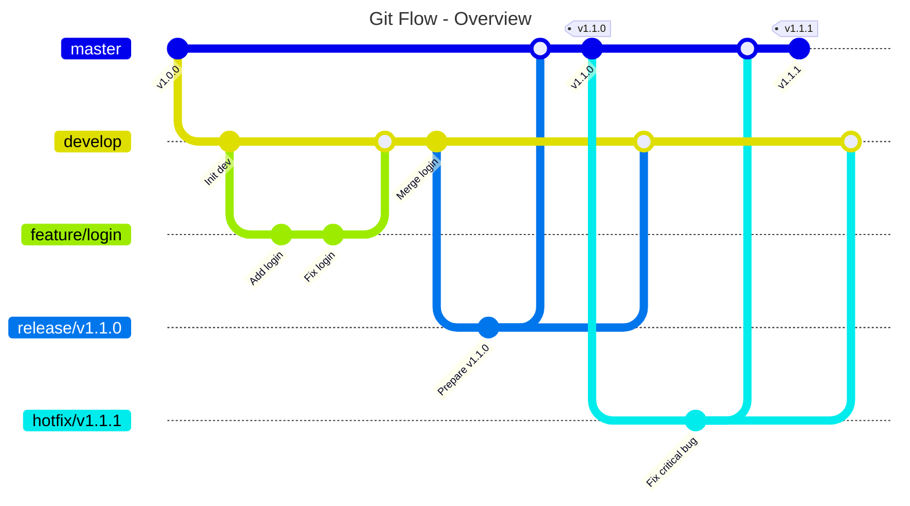
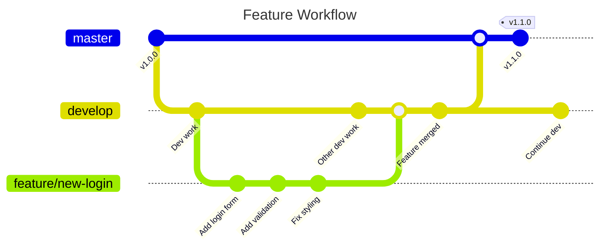
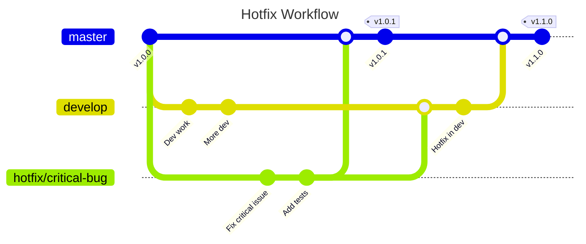
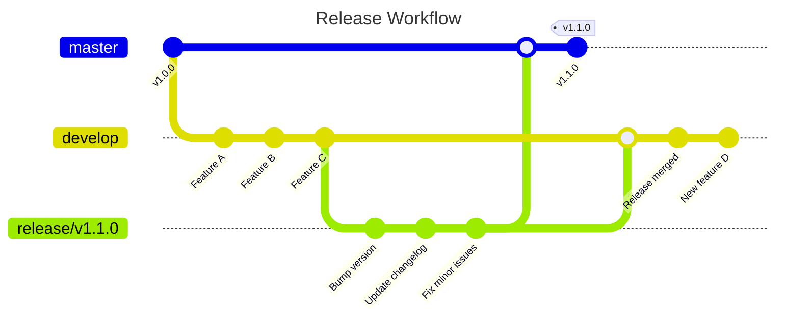
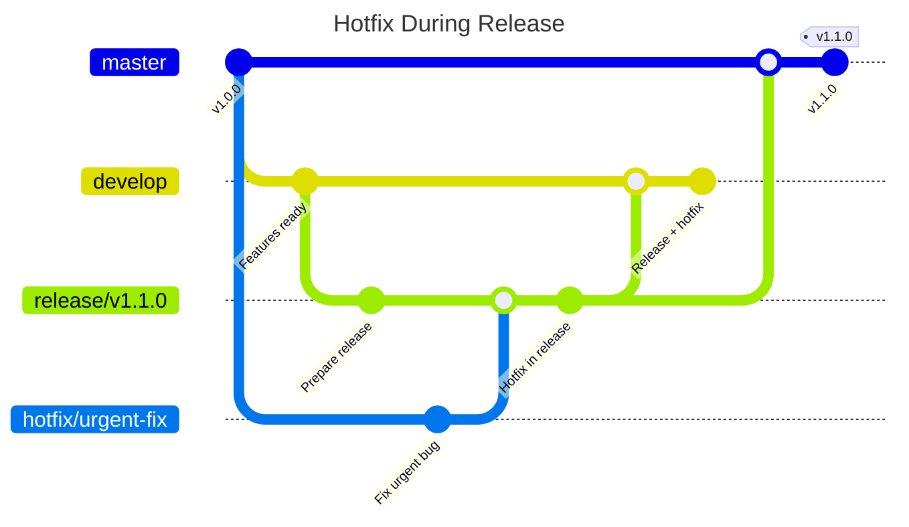

# The `gitktti` project *- by saumon™*

The `gitktti` scripts are provided to help developers safely use git flow. So powerful...
>**saumon:** Yes so powerful!

## Table of contents

- [The `gitktti` project *- by saumon™*](#the-gitktti-project---by-saumon)
  - [Table of contents](#table-of-contents)
  - [Description](#description)
    - [Git flow principles](#git-flow-principles)
    - [Branch types](#branch-types)
  - [Detailed workflows](#detailed-workflows)
    - [Feature workflow](#feature-workflow)
    - [Hotfix workflow](#hotfix-workflow)
    - [Release workflow](#release-workflow)
    - [Hotfix during release workflow](#hotfix-during-release-workflow)
  - [Installation](#installation)
    - [Environment setup](#environment-setup)
    - [Recommended aliases](#recommended-aliases)
    - [Alias descriptions](#alias-descriptions)
    - [Usage examples](#usage-examples)
  - [Releases](#releases)
    - [Release `1.2.0` - 18/08/2025](#release-120---18082025)
    - [Release `1.1.0` - 17/08/2025](#release-110---17082025)
    - [Release `1.0.4` - 16/08/2025](#release-104---16082025)
    - [Release `1.0.3` - 07/08/2025](#release-103---07082025)
    - [Release `1.0.2` - 28/06/2025](#release-102---28062025)
    - [Release `1.0.1` - 25/03/2023](#release-101---25032023)
    - [Release `1.0.0` - 23/03/2023](#release-100---23032023)

## Description

Git flow is a branching methodology that organizes development around two main branches:

- **`master`** : production branch containing only stable and tagged code
- **`develop`** : development branch where all new features are integrated

### Git flow principles



### Branch types

- **`feature/*`** : development of new features (branched from `develop`)
- **`release/*`** : preparation of a new version (branched from `develop`)
- **`hotfix/*`** : urgent fixes in production (branched from `master`)

## Detailed workflows

### Feature workflow

Feature branches are used to develop new functionality. They are created from
`develop` and merged back into `develop` when complete.



**Commands used:**

```bash
# Create feature branch
kfeat -n feat/new-login
# or
kfix --mode feature --name new-login

# Finalize feature (merge to develop)
kfixend
```

### Hotfix workflow

Hotfix branches are used for urgent production fixes. They branch from `master`
and merge back to both `master` and `develop`.



**Commands used:**

```bash
# Create hotfix branch (from master)
kfix -n critical-bug
# or
kfix --name critical-bug

# Finalize hotfix (merge to master and develop, create tag)
kfixend
```

### Release workflow

Release branches are used to prepare a new version. They branch from `develop`,
allow for final adjustments, then merge to both `master` and `develop`.



**Commands used:**

```bash
# Create release branch (from develop)
kfix --mode release
# or
kreal
# This will propose version numbers based on last tag

# Finalize release (merge to master and develop, create tag)
kfixend
```

### Hotfix during release workflow

Special case: when a release is in progress and a hotfix is needed, the hotfix
must be merged into the release branch first.



**Commands used:**

```bash
# Create hotfix as usual
kfix

# When finalizing, the script will detect the release branch
# and automatically merge hotfix into release instead of develop
kfixend
```

## Installation

### Environment setup

You need to set the following environment variable:

```bash
export PERL5LIB=..../gitktti/modules
```

### Recommended aliases

I recommend creating these aliases for easier usage:

```bash
alias kfeat='....../gitktti_fix.pl --mode feature'
alias kreal='....../gitktti_fix.pl --mode release'
alias kprune='...../gitktti_fix.pl --prune'
alias kfix='......./gitktti_fix.pl'
alias kfixend='..../gitktti_fixend.pl'
alias ktag='......./gitktti_tag.pl'
alias kco='......../gitktti_checkout.pl'
alias kmove='....../gitktti_move.pl'
```

### Alias descriptions

| Alias | Purpose | Description |
|-------|---------|-------------|
| `kfeat` | **Create feature branch** | Creates a new feature branch from `develop`. Equivalent to `kfix --mode feature` |
| `kreal` | **Create release branch** | Creates a new release branch from `develop`. Equivalent to `kfix --mode release` |
| `kprune` | **Clean local branches** | Deletes local branches that have been merged and are no longer needed |
| `kfix` | **Create hotfix/feature branch** | Creates a new branch (hotfix from `master` by default, or feature/release with `--mode`) |
| `kfixend` | **Finalize current branch** | Merges the current branch to appropriate target(s) and creates tags if needed |
| `ktag` | **Create/manage tags** | Creates or manages version tags on the repository |
| `kco` | **Smart checkout** | Intelligent branch checkout with Git flow awareness |
| `kmove` | **Rename branch** | Renames current branch locally and remotely |

### Usage examples

```bash
# Start working on a new feature
kfeat --name user-authentication # Creates feature/user-authentication

# Create a hotfix for production
kfix --name critical-security-fix # Creates hotfix/critical-security-fix from master

# Prepare a new release
kreal                           # Creates release/vX.Y.Z from develop

# Finish your work
kfixend                         # Merges current branch and handles Git flow

# Clean up merged branches
kprune                          # Removes local branches that are fully merged

# Create a tag manually
ktag                            # Creates and pushes tag

# Smart branch switching
kco                             # Switches to another branch

# Rename current branch
kmove --name feature/new-name   # Renames current branch locally and remotely
kmove                           # Interactive branch renaming
```

***

## Releases

### Release `1.2.0` - 18/08/2025

- NEW FEATURES:
  - **kmove:** new script for renaming branches
  - **kfeat:** removed --tag option

### Release `1.1.0` - 17/08/2025

- NEW FEATURES:
  - **gitkkti:** changed branches naming convention

### Release `1.0.4` - 16/08/2025

- NEW FEATURES:
  - **gitkkti:** console output modernization

### Release `1.0.3` - 07/08/2025

- NEW FEATURES:
  - **kco:** command is now less strict when using `--delete` arg

### Release `1.0.2` - 28/06/2025

- NEW FEATURES:
  - **README:** added detailed workflows for feature, hotfix, release, and hotfix
    during release

### Release `1.0.1` - 25/03/2023

- NEW FEATURES:
  - **kprune:** added possibility to delete local branches

### Release `1.0.0` - 23/03/2023

- NEW FEATURES:
  - **gitktti:** forked from top secret project: `git_catti (v6.14)`
