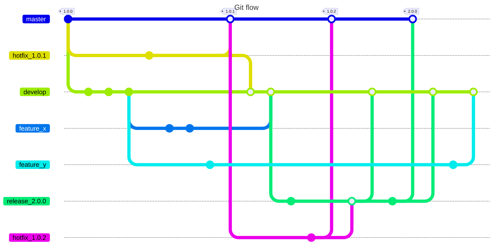
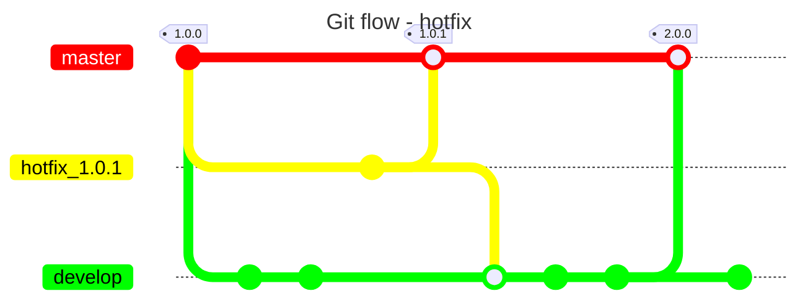
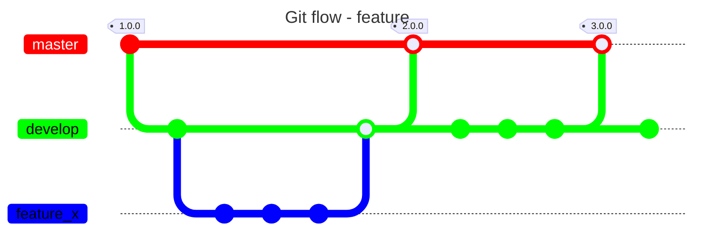

# The `gitktti` project *- by R&Oslash;BU&trade;*

The `gitktti` scripts are provided to help developers safely use git flow. So powerful...
>**r&oslash;bu:** Yes so powerful!

## Table of contents

- [The `gitktti` project *- by RØBU™*](#the-gitktti-project---by-røbu)
  - [Table of contents](#table-of-contents)
  - [Description](#description)
  - [Installation](#installation)
  - [Releases](#releases)
    - [Release `1.0.2` - JJ/MM/2023](#release-102---jjmm2023)
    - [Release `1.0.1` - 25/03/2023](#release-101---25032023)
    - [Release `1.0.0` - 23/03/2023](#release-100---23032023)

## Description

Git flow purpose:


```mermaid
---
title: Git flow
---
%%{init: { 'gitGraph': {'showCommitLabel': false, 'mainBranchName': 'master'}} }%%
gitGraph
    commit tag:"1.0.0"
    branch hotfix_1.0.1
    checkout master
    branch develop
    checkout develop
    commit
    commit
    checkout develop
    commit
    checkout hotfix_1.0.1
    commit
    checkout develop
    branch feature_x
    commit
    commit
    checkout develop
    branch feature_y
    commit
    checkout master
    merge hotfix_1.0.1 tag: "1.0.1"
    checkout develop
    merge hotfix_1.0.1
    checkout develop
    merge feature_x
    branch release_2.0.0
    checkout release_2.0.0
    commit
    checkout master
    branch hotfix_1.0.2
    commit
    checkout master
    merge hotfix_1.0.2 tag: "1.0.2"
    checkout release_2.0.0
    merge hotfix_1.0.2
    checkout develop
    merge release_2.0.0
    checkout release_2.0.0
    commit
    checkout master
    merge release_2.0.0 tag: "2.0.0"
    checkout develop
    merge release_2.0.0
    checkout feature_y
    commit
    checkout develop
    merge feature_y
```


```mermaid
---
title: Git flow - hotfix
---
%%{init: { 'gitGraph': {'showCommitLabel': false, 'mainBranchName': 'master'}} }%%
  %%{init: { 'logLevel': 'debug', 'theme': 'default' , 'themeVariables': {
            'git0': '#ff0000',
            'git1': '#ffff00',
            'git2': '#00ff00'
      } } }%%
gitGraph
    commit tag:"1.0.0"
    branch hotfix_1.0.1
    checkout master
    branch develop
    commit
    commit
    checkout hotfix_1.0.1
    commit
    checkout master
    merge hotfix_1.0.1 tag: "1.0.1"
    checkout develop
    merge hotfix_1.0.1
    commit
    commit
    checkout master
    merge develop tag: "2.0.0"
    checkout develop
    commit
```


```mermaid
---
title: Git flow - feature
---
%%{init: { 'gitGraph': {'showCommitLabel': false, 'mainBranchName': 'master'}} }%%
  %%{init: { 'logLevel': 'debug', 'theme': 'default' , 'themeVariables': {
            'git0': '#ff0000',
            'git1': '#00ff00',
            'git2': '#0000ff'
      } } }%%
gitGraph
    commit tag:"1.0.0"
    branch develop
    commit
    branch feature_x
    commit
    commit
    commit
    checkout develop
    merge feature_x
    checkout master
    merge develop tag: "2.0.0"
    checkout develop
    commit
    commit
    commit
    checkout master
    merge develop tag: "3.0.0"
    checkout develop
    commit
```

## Installation

I recommend to create these aliases:

```bash
alias kfeat='....../gitktti_fix.pl --mode feature'
alias kreal='....../gitktti_fix.pl --mode release'
alias kprune='...../gitktti_fix.pl --prune'
alias kfix='......./gitktti_fix.pl'
alias kfixend='..../gitktti_fixend.pl'
alias ktag='......./gitktti_tag.pl'
alias kco='......../gitktti_checkout.pl'
```

You need to set following environment variable:

```text
export PERL5LIB=..../gitktti/modules
```

***

## Releases

### Release `1.0.2` - JJ/MM/2023

- NEW FEATURES:
  - **???:** wip

### Release `1.0.1` - 25/03/2023

- NEW FEATURES:
  - **kprune:** added possibility to delete local branches

### Release `1.0.0` - 23/03/2023

- NEW FEATURES:
  - **gitktti:** forked from top secret project: `git_catti (v6.14)`
